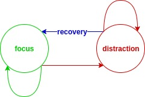
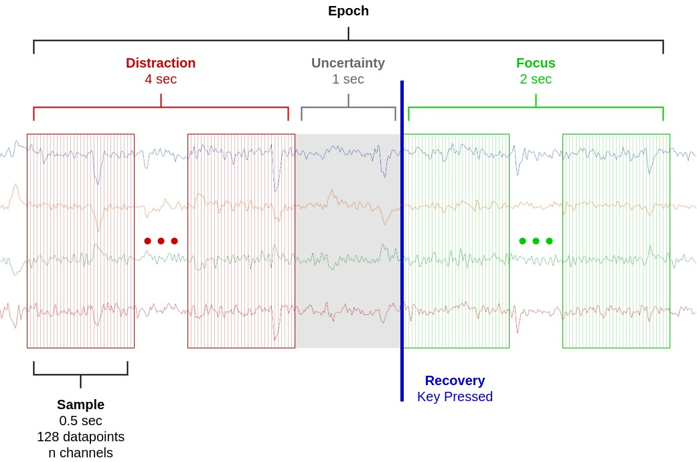

## Step 1: Learning
In the moment, one can be (and usually is) distracted without realizing it. There is an exception to this, though, which we might call the "recovery". When meditating, one proceeds through several cycles of attempting to hold one's attention on an object of focus (the breath, for example), eventually failing and becoming distracted, and then (sometime later) recognizing the distraction and returning to the object of focus. This moment of realization is the "recovery". In that moment, one can be sure that one was previously distracted but is now focused again.

Simplistically, one can think of this as a simple state machine or an HMM with two latent states: focus and distraction. At any time _t_, the meditator can stay in their current state or transition to the other. When transitioning from distraction to focus, the meditator realizes their previous distracted state and signals a recovery.

If the meditator's biosignals are being recorded along with the times of these recoveries, then for each recovery we have two labeled time periods: the moments preceding a recovery are "distraction", and those following (up to a point) are "focus". 

The meditator signals a recovery by pressing a button. To minimizes noise in the signal due to movement, the button is positioned such that only a small movement of the index finger is needed to press it. Depending on the meditator's hand position while meditating, either the button is resting in their palm (palm up) or their finger is resting on the button (palm down).

By repeating this process many times and with many subjects, we collect a dataset from which we can learn to detect distraction.

We refer to the time surrounding a recovery as an "epoch". Each epoch can be broken down into many labeled "samples", which are the input to our machine-learning model. At a recording frequency of 256Hz for EEG, a sample of 0.5 seconds contains 128 datapoints for each of the n channels in the EEG stream.

Note that data from the 1 second preceding the recovery is discarded. From personal experience, this time period cannot be neatly categorized as either distraction or focus. Sometimes the distraction is noticed, but attention has not yet been returned to the object of focus. Sometimes attention returns in a piecemeal fashion. We believe we will have better results by not training on this time period.

## Step 2: Training
Once a reliable method for detecting distraction has been established, we can use it in our closed-loop system. Once again, the subject is asked to meditate while their biosignals are recorded. Now, however, we can detect distraction before the subject is aware of it themselves. When we do, we allow the subject a "grace period" to recover on their own. When the grace period elapses, we provide a subtle queue (e.g. a bell chime) to bring the subject's focus back to the present, and so the cycle repeats. By progressively shortening these "grace periods", we train the subject to recognize and detach from their distraction more quickly. If this training transfers to other aspects of life, I believe it can seriously alleviate emotional suffering.